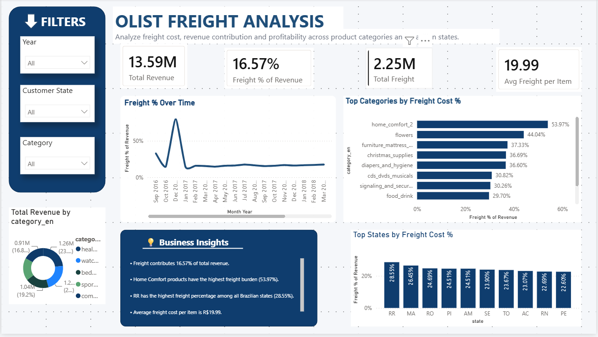
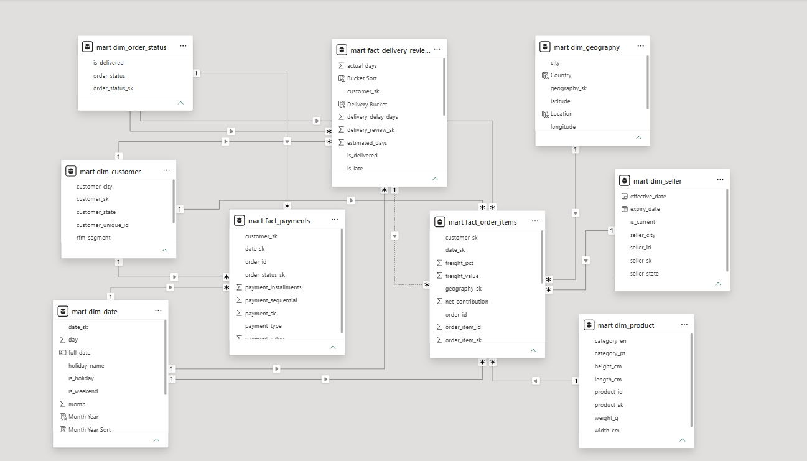

# Olist E-Commerce Data Warehouse & Business Intelligence

**An end-to-end analytics project: raw transactional data → a governed star-schema warehouse (SQL Server) → business-ready Power BI dashboards — surfacing where margin leaks, what drives customer satisfaction, and which customers create the most value.**

> Built on the [Olist Brazilian E-Commerce dataset](https://www.kaggle.com/datasets/olistbr/brazilian-ecommerce) (~100K orders, 9 related source tables, 2016–2018).

---

## Why this project

Retailers sit on transactional data but rarely turn it into decisions. This project takes nine raw source tables from a Brazilian e-commerce marketplace, models them into an analytics-ready data warehouse, and delivers three business questions answered with evidence:

1. **Where is profit leaking to shipping costs?**
2. **What actually drives customer satisfaction?**
3. **Which customers are worth the most, and are we serving them well?**

The result is a decision-support asset, not just a report — a validated warehouse that any BI tool can query, plus dashboards that translate 1.5M+ rows into clear recommendations.

---

## Key business findings

### 1. Freight is a hidden margin drain — and it's concentrated
- Shipping costs equal **16.6% of total revenue** marketplace-wide (R$2.25M of R$13.6M).
- But the burden is wildly uneven: categories like **home comfort and flowers carry freight at 40–55% of item value** — meaning nearly half the price is shipping.
- Geographically, remote states (Bahia, Mato Grosso, Espírito Santo) bear the heaviest freight load.
- **Recommendation:** renegotiate carrier rates or set category-specific free-shipping thresholds for the high-freight categories; they are structurally less profitable and need pricing intervention.

### 2. Late delivery is the single biggest driver of bad reviews
- On-time or early orders average **4.0–4.3 stars**. The moment an order is even **one day late, the average review drops to ~3.0** — and orders **5+ days late collapse to 1.74 stars**.
- Late deliveries (≈7,700 orders) average **2.57 stars vs 4.29 for on-time — a 1.7-star gap**.
- **Recommendation:** delivery reliability, not price or product, is the dominant lever on satisfaction. Even marginal lateness is disproportionately damaging, so the highest-ROI investment is tightening delivery-time estimates and reducing late shipments.

### 3. A small customer segment drives outsized value
- Using **RFM segmentation** (Recency, Frequency, Monetary), **Champions and Big Spenders make up only ~3.5% of customers but spend 1.7–2.2× the average** (R$372 and R$279 vs a R$166 baseline).
- The marketplace has a **low ~3.4% repeat-purchase rate**, so a large "At Risk / one-time" population dominates by count while a tiny high-value core drives revenue efficiency.
- **Recommendation:** disproportionate retention spend on Champions/Big Spenders yields the highest return; the large one-time-buyer base is a reactivation opportunity.

---

## Dashboards

Three interactive Power BI pages translate the warehouse into decisions.

### Page 1 — Freight as a Margin Drag
*Freight burden by product category and region, with revenue/freight KPIs.*

<!-- TODO: add screenshot -->


### Page 2 — Delivery Performance & Customer Satisfaction
*The relationship between delivery timing and review scores — the headline "satisfaction cliff."*

<!-- TODO: add screenshot -->


### Page 3 — Customer Segmentation (RFM)
*Customer segments by count, revenue, and average value — plus satisfaction cross-cut by segment.*

<!-- TODO: add screenshot -->


---

## Architecture

Raw CSVs are landed untouched, cleaned and conformed, then modeled into a star schema optimized for analysis — a layered ("medallion-style") design that separates raw data from business-ready marts.

```
  Source CSVs (9 tables)
          │
          ▼
   ┌──────────────┐   staging schema   — raw, as-loaded, no constraints
   │   STAGING    │
   └──────────────┘
          │  cleansing, type-casting, deduplication
          ▼
   ┌──────────────┐   intermediate schema — conformed, cleaned
   │ INTERMEDIATE │
   └──────────────┘
          │  surrogate keys, SCD-2, unknown-member routing
          ▼
   ┌──────────────┐   mart schema — star schema (facts + dimensions)
   │     MART     │ ──────────────►  Power BI
   └──────────────┘
          │
          ▼
   ┌──────────────┐   dq schema — data-quality checks & load control
   │      DQ      │
   └──────────────┘
```

### Star schema

Two conformed fact tables share six dimensions, so any measure can be sliced by any dimension consistently.

<!-- TODO: add the dbdiagram star-schema image -->


**Facts**
- `fact_order_items` — one row per item line per order (112,650 rows); revenue, freight, derived margin measures
- `fact_payments` — one row per payment per order (103,886 rows)
- `fact_delivery_reviews` — one row per order (99,441 rows); delivery timing vs review score

**Dimensions**
- `dim_date` — full calendar with Brazilian holidays (Carnival, Independence Day, etc.)
- `dim_customer` — keyed on stable customer identity + RFM segment
- `dim_product` — with Portuguese→English category translation
- `dim_seller` — **Slowly Changing Dimension (Type 2)** with effective/expiry versioning
- `dim_geography` — deduplicated location reference (1M rows → 19,015 unique zips)
- `dim_order_status`

---

## Technical highlights

This project deliberately applies production-grade warehousing patterns rather than a single flat model:

| Capability | Implementation |
|---|---|
| **Layered architecture** | Separate staging / intermediate / mart / dq schemas |
| **Dimensional modeling** | Star schema with conformed dimensions and integer surrogate keys |
| **Slowly Changing Dimension (Type 2)** | `dim_seller` versions attribute changes with effective/expiry dates and an `is_current` flag |
| **Incremental loading** | Watermark (high-water-mark) pattern with a load-control table — processes only new records, not full reloads |
| **Data-quality framework** | 11 automated checks across 5 categories (reconciliation, integrity, uniqueness, validity, completeness) that self-report PASS/FAIL |
| **Unknown-member handling** | Orphaned references route to a `-1` member — **zero rows dropped**, full auditability |
| **Reproducible ETL** | Scripted `BULK INSERT` (not manual imports) so the whole pipeline rebuilds from source |
| **Reconciliation** | Warehouse revenue ties out to source to the cent (R$13,591,643.70) |

---

## Data quality & honest scope

Rigor includes being clear about limitations:

- **Margin is framed as contribution after freight** (price − freight). The dataset contains selling price and shipping cost but not product cost, so true gross margin isn't computable — the freight-drag analysis is scoped accordingly.
- **Effective analysis window is Jan 2017 – Aug 2018.** 2016 is near-empty (a handful of orders) and the 2018 tail is partial; trend analysis is scoped to the dense period.
- **Delivery analysis is scoped to delivered orders** (97% of the total); canceled/unavailable orders have no delivery date by definition.
- **All quality findings are logged** (`docs/data-quality-log.md`) with evidence and resolution — e.g. 302 orders with unmatched geography were routed to the unknown member rather than dropped.

---

## Tech stack

- **Database / warehouse:** SQL Server (Developer Edition), T-SQL
- **ETL:** T-SQL scripts, `BULK INSERT`, stored procedures
- **Analytics / BI:** Power BI Desktop (DAX measures, star-schema model)
- **Modeling / docs:** dbdiagram.io
- **Version control:** Git / GitHub

---

## Repository structure

```
olist-ecommerce-warehouse/
├── README.md
├── sql/
│   ├── 01_setup.sql                  # database + layered schemas
│   ├── 02_staging_load.sql           # scripted BULK INSERT of 9 CSVs
│   ├── 03_profiling.sql              # data profiling & grain analysis
│   ├── 04_dim_date.sql               # date dimension w/ Brazilian holidays
│   ├── 05_dimensions.sql             # all dimensions incl. SCD-2 & geo dedup
│   ├── 06_facts.sql                  # fact tables w/ surrogate-key lookups
│   ├── 07_incremental_load.sql       # watermark incremental pipeline
│   ├── 08_dq_framework.sql           # data-quality validation suite
│   ├── 09_rfm.sql                    # RFM customer segmentation
│   ├── 10_final_validation.sql       # end-to-end consistency checks
│   └── 11_fact_delivery_reviews.sql  # delivery-vs-satisfaction fact
├── powerbi/
│   └── olist_warehouse.pbix
└── docs/
    ├── star-schema.png
    ├── data-dictionary.md
    ├── data-quality-log.md
    └── dashboard_*.png
```

---

## How to reproduce

1. Download the [Olist dataset from Kaggle](https://www.kaggle.com/datasets/olistbr/brazilian-ecommerce) and place the 9 CSVs in a local `data/` folder. *(Do not open the CSVs in Excel — some contain more rows than Excel's limit.)*
2. In SQL Server, run the `sql/` scripts in numerical order (`01` → `11`), adjusting the file path in `02_staging_load.sql` to your `data/` folder.
3. Open `powerbi/olist_warehouse.pbix` in Power BI Desktop and point the connection at your `OlistDW` database.

---

## What this demonstrates

- Translating raw operational data into **clear business recommendations** (freight strategy, delivery SLAs, retention targeting)
- **Dimensional modeling and ETL** from first principles
- **Data governance** — quality checks, reconciliation, documented assumptions
- **BI storytelling** — dashboards designed around decisions, not just charts

---

*Data: Olist Brazilian E-Commerce Public Dataset (Kaggle). This is a portfolio project; findings reflect the dataset, not live business operations.*
