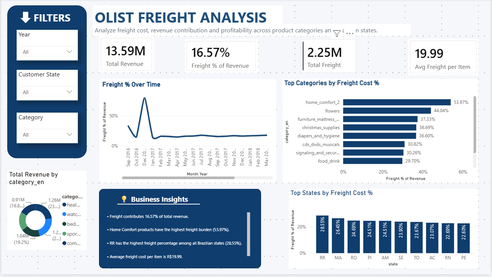
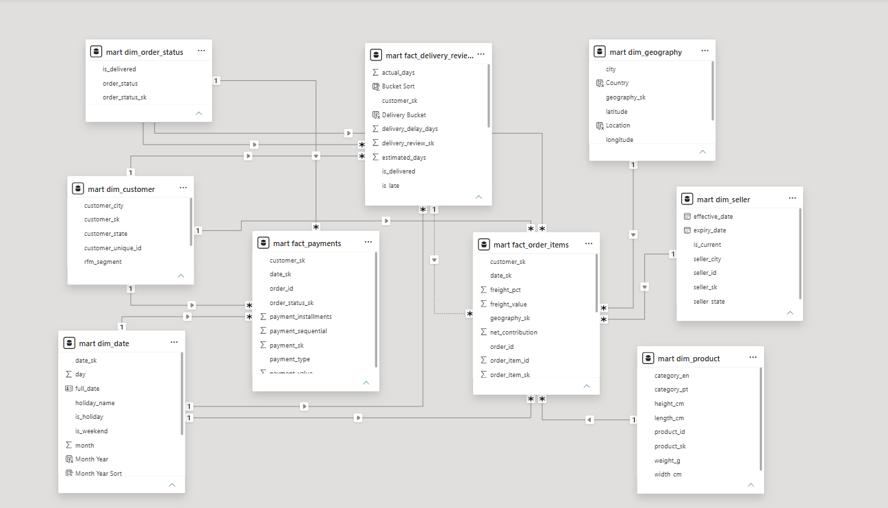

# Olist E-Commerce Data Warehouse & Business Intelligence

An end-to-end analytics project that takes raw Olist Brazilian e-commerce data through a governed SQL Server data warehouse and into Power BI dashboards. The project focuses on three business questions:

1. Where is profit leaking to shipping costs?
2. What drives customer satisfaction?
3. Which customers create the most value?

The analytical warehouse is also served through a live web application. The warehouse mart was ported from SQL Server to PostgreSQL, and the freight analysis was rebuilt as a Django application running behind uWSGI and Nginx on a self-managed Linux server.

**[→ View Live Dashboard](http://130.210.14.37/)**

Built using the [Olist Brazilian E-Commerce dataset](https://www.kaggle.com/datasets/olistbr/brazilian-ecommerce), which contains approximately 100K orders across 9 related source tables covering 2016–2018.

---

## Project Overview

The project starts with the nine raw Olist source tables and builds an analytics-ready data warehouse using a layered architecture:

- **Staging** — raw source data loaded as-is
- **Intermediate** — cleaned and conformed data
- **Mart** — dimensional star schema used for analysis
- **DQ** — automated data-quality and load-control checks

The warehouse is built in SQL Server using T-SQL and is connected to Power BI for business analysis.

To make the analysis accessible outside Power BI Desktop, the mart was also ported to PostgreSQL. A Django application reads the PostgreSQL serving copy and presents the freight analysis through a web interface. The application is deployed on an Oracle Cloud Always Free VM using uWSGI, Nginx, systemd, and Ubuntu.

This means the project covers the full path from **raw transactional data → ETL → dimensional modeling → data quality → BI analysis → database portability → web application → production-style deployment**.

---

## Business Questions and Findings

### 1. Where is profit leaking to shipping costs?

The dataset does not contain product cost, so true gross margin cannot be calculated. Instead, the project uses **contribution after freight**, defined as:

`price - freight`

Across the marketplace:

- Shipping costs account for **16.6% of total revenue**.
- Total revenue is **R$13.6M**, while freight is approximately **R$2.25M**.
- The freight burden varies substantially between product categories.
- Categories such as **home comfort and flowers** have freight-to-item-value ratios of approximately **40–55%**.
- Remote states including **Bahia, Mato Grosso, and Espírito Santo** carry some of the highest freight burdens.

The analysis therefore points toward two possible business interventions: renegotiating carrier rates and introducing category-specific free-shipping thresholds for categories where freight represents a large share of item value.

The project does not present this as true profitability because the source data does not contain product costs.

---

### 2. What drives customer satisfaction?

The delivery analysis compares delivery timing with customer review scores.

The relationship is particularly visible once an order becomes late:

- Orders delivered on time or early average approximately **4.0–4.3 stars**.
- When an order is even **one day late**, the average review falls to approximately **3.0 stars**.
- Orders that are **5+ days late** average only **1.74 stars**.
- Approximately **7,700 orders** are late.
- Late orders average **2.57 stars**, compared with **4.29 stars** for on-time orders.
- This represents approximately a **1.7-star difference**.

The analysis therefore identifies delivery reliability as a major factor associated with customer satisfaction. The resulting business recommendation is to focus on reducing late deliveries and improving delivery-time estimates rather than treating delivery as a secondary operational metric.

The delivery analysis is limited to delivered orders, which represent approximately **97% of the total dataset**. Cancelled and unavailable orders do not have delivery dates by definition.

---

### 3. Which customers create the most value?

Customer value is analyzed using **RFM segmentation**:

- **Recency**
- **Frequency**
- **Monetary value**

The segmentation shows that a relatively small group of customers accounts for disproportionately high spending:

- **Champions and Big Spenders** represent approximately **3.5% of customers**.
- Champions spend approximately **R$372** on average.
- Big Spenders spend approximately **R$279** on average.
- The overall baseline is approximately **R$166**.
- The marketplace has a relatively low **~3.4% repeat-purchase rate**.

As a result, most customers are one-time or at-risk customers by count, while a small high-value customer group contributes substantially more value per customer.

The analysis suggests separating retention strategies by segment: high-value segments can receive disproportionate retention attention, while the much larger one-time-buyer population represents a reactivation opportunity.

---

# Dashboards

The warehouse feeds three interactive Power BI pages. The freight analysis is also available through the deployed Django web application.

## Page 1 — Freight as a Margin Drag

This page analyzes freight burden across product categories and geography.

It includes revenue and freight KPIs and allows freight costs to be examined by category and region.



---

## Page 2 — Delivery Performance & Customer Satisfaction

This page examines the relationship between delivery timing and customer review scores.

The main analysis focuses on how quickly customer satisfaction deteriorates as deliveries become late.


---

## Page 3 — Customer Segmentation (RFM)

This page breaks customers into RFM segments and compares the segments by customer count, revenue, average value, and satisfaction.


---

# Architecture

The warehouse uses a layered architecture that separates raw data from cleaned data and business-ready analytical data.

```text
Source CSVs (9 tables)
        │
        ▼
┌──────────────┐
│   STAGING    │   staging schema
└──────────────┘
        │
        │ cleansing, type-casting, deduplication
        ▼
┌──────────────┐
│ INTERMEDIATE │   intermediate schema
└──────────────┘
        │
        │ surrogate keys, SCD-2,
        │ unknown-member routing
        ▼
┌──────────────┐
│     MART     │   star schema
└──────────────┘
        │
        ├──────────────► Power BI
        │
        └──────────────► PostgreSQL serving copy
                              │
                              ▼
                       Django / uWSGI / Nginx

┌──────────────┐
│      DQ      │   data-quality checks
└──────────────┘
```

The staging schema contains the source data in its original form. The intermediate layer performs cleansing and conformance. The mart contains the final dimensional model used by the BI layer and serving application. The DQ schema contains automated validation and load-control logic.

---

# Star Schema

The warehouse contains three fact tables and six shared dimensions. The conformed dimensions allow measures from different facts to be analyzed consistently.



## Fact Tables

### `fact_order_items`

- One row per item line per order
- **112,650 rows**
- Contains revenue, freight, and derived margin-related measures

### `fact_payments`

- One row per payment per order
- **103,886 rows**

### `fact_delivery_reviews`

- One row per order
- **99,441 rows**
- Used to analyze delivery timing against customer review scores

## Dimensions

### `dim_date`

A complete calendar dimension containing Brazilian holidays such as Carnival and Independence Day.

### `dim_customer`

Contains customer identities and their RFM segments.

### `dim_product`

Contains product information, including Portuguese-to-English category translation.

### `dim_seller`

A **Slowly Changing Dimension Type 2** that maintains versions of seller attributes using effective and expiry dates and an `is_current` flag.

### `dim_geography`

A deduplicated geographical reference.

The source contains approximately **1M location rows**, which are reduced to **19,015 unique ZIP-code locations**.

### `dim_order_status`

Contains standardized order-status information used across the warehouse.

---

# Data Warehouse Design

The project uses several warehouse patterns to make the data model reusable and auditable.

## Layered schemas

The database separates:

- `staging`
- `intermediate`
- `mart`
- `dq`

This prevents raw source data, transformation logic, analytical structures, and quality-control logic from being mixed together.

## Surrogate keys

The dimensions use integer surrogate keys rather than relying directly on source-system identifiers.

## Unknown members

Unmatched dimension references are routed to a dedicated `-1` unknown member instead of dropping fact rows.

This preserves the complete source population while making unresolved references visible and auditable.

## Slowly Changing Dimension Type 2

`dim_seller` uses SCD Type 2 to retain historical versions of seller attributes.

Each version contains effective/expiry dates and an `is_current` flag.

## Incremental loading

The warehouse implements a watermark/high-water-mark pattern through a load-control table.

Once the initial load has completed, subsequent loads can process only new records instead of rebuilding the entire warehouse.

---

# ETL Pipeline

The warehouse is rebuilt through scripted T-SQL rather than manual imports.

The source CSVs are loaded using `BULK INSERT`, then transformed through the intermediate layer before being loaded into the dimensional model.

The main pipeline is:

```text
CSV files
   │
   ▼
Staging
   │
   ▼
Profiling / grain analysis
   │
   ▼
Intermediate cleansing
   │
   ▼
Dimensions
   │
   ▼
Facts
   │
   ▼
RFM segmentation
   │
   ▼
Data-quality validation
   │
   ▼
Final warehouse validation
```

The complete SQL pipeline is contained in the `sql/` directory and is intended to be run in numerical order.

---

# Data Quality

Data quality is treated as part of the warehouse rather than as a separate manual step.

The project contains **11 automated checks across five categories**:

- Reconciliation
- Integrity
- Uniqueness
- Validity
- Completeness

The checks self-report `PASS` / `FAIL` and are used during warehouse validation.

## Reconciliation

The warehouse revenue reconciles to the source dataset to the cent:

**R$13,591,643.70**

The same headline value is independently reproduced after the mart is ported to PostgreSQL.

## Unknown-member routing

The warehouse does not silently drop unmatched records. Instead, orphaned references are routed to the `-1` unknown member.

For example, **302 orders with unmatched geography** are retained and routed to the unknown geography member.

The findings and resolutions are documented in:

`docs/data-quality-log.md`

---

# PostgreSQL Serving Layer

The Power BI `.pbix` file is useful for desktop analysis but does not provide a simple way to expose the analysis through a public URL.

For this reason, the analytical mart was given a second serving layer.

The mart was exported from SQL Server, translated to PostgreSQL, reconciled against the original warehouse, and then exposed through Django.

**[→ View Live Dashboard](http://130.210.14.37/)**

The serving architecture is:

```text
Browser
   │
   │ HTTP :80
   ▼
┌─────────┐
│  Nginx  │
└─────────┘
   │
   │ uwsgi_pass over Unix socket
   ▼
┌─────────┐
│  uWSGI  │
└─────────┘
   │
   │ WSGI
   ▼
┌─────────┐
│ Django  │
└─────────┘
   │
   │ psycopg
   ▼
┌──────────────┐
│ PostgreSQL 16│
└──────────────┘
```

The deployed Django application uses:

- **Django 6.1**
- **uWSGI**
- **Nginx**
- **PostgreSQL 16**
- **psycopg**

The uWSGI process configuration uses **2 processes × 2 threads** and is managed through systemd.

---

# Porting SQL Server to PostgreSQL

Eight mart tables were translated from the SQL Server implementation and loaded into PostgreSQL.

The PostgreSQL implementation is located in:

`serving/postgres/`

The main differences are:

| SQL Server | PostgreSQL | Reason |
|---|---|---|
| `INT IDENTITY(1,1)` | `INT GENERATED BY DEFAULT AS IDENTITY` | `BY DEFAULT` allows upstream surrogate keys, including `-1` unknown members, to load unchanged |
| `BIT` | `BOOLEAN` | Exported `0` / `1` values can be loaded directly with `COPY` |
| `DECIMAL(p,s)` | `NUMERIC(p,s)` | Preserves exact monetary precision |
| `MERGE` | `INSERT ... ON CONFLICT` | SCD-2 logic remains in SQL Server; the serving copy contains current rows only |

The PostgreSQL port is accepted only after reconciliation. A successful load by itself is not considered sufficient.

The reconciliation script:

`serving/postgres/22_reconcile_postgres.sql`

checks:

- Row counts by table
- Unknown-member routing rates
- Headline totals

The warehouse and PostgreSQL serving copy both reconcile to:

**R$13,591,643.70**

---

# Foreign Keys and Load Validation

Foreign keys are created **after** the PostgreSQL data load.

This allows the 112,650 fact rows to be loaded first and then validated against all six dimensions in a single pass.

This approach also exposed a silent load failure that had not been visible in the original SQL Server load.

One dimension had finished empty even though the pipeline reported success. When the foreign key was added, PostgreSQL rejected the constraint and identified the offending references.

The issue was then located and corrected.

This illustrates an important property of the serving layer: declaring foreign keys converted a silent data problem into an explicit, identifiable failure.

---

# Django Application Design

The application intentionally uses both the Django ORM and raw SQL.

## Django ORM

The filter dropdowns use the ORM for simple `DISTINCT` lookups against individual dimensions.

These queries are straightforward and fit naturally into the ORM.

## Raw SQL

The KPIs and four analytical charts use raw SQL through:

`connection.cursor()`

These queries perform star-schema aggregations across the 112K-row fact table and multiple dimensions.

The raw SQL approach was chosen because the queries require specific grouping and aggregation behavior. Reproducing the same logic through the ORM would make the query construction unnecessarily complicated and could result in less efficient SQL.

## Read-only Django models

The Django models use:

```python
managed = False
```

The warehouse is created and loaded by SQL scripts in `sql/` and `serving/postgres/`.

Django therefore reads the existing warehouse tables rather than managing their schema. Running `makemigrations` will not attempt to alter these tables.

## Query safety

User-selected filters are passed as bound parameters rather than being interpolated into SQL strings.

## Freight calculation

The freight percentage is calculated as:

```text
SUM(freight_value) / SUM(price)
```

This matches the Power BI measure:

```text
DIVIDE([Total Freight], [Total Revenue])
```

It is deliberately **not** calculated as the average of the row-level `freight_pct` values.

A simple average would give an R$5 item the same weight as an R$500 item. Using the ratio of totals keeps the calculation weighted by actual transaction value.

---

# Infrastructure

The application runs on an **Oracle Cloud Always Free VM** with:

- Ubuntu 24.04
- 1 GB RAM
- 2 vCPU

Because the host has only 1 GB of RAM, PostgreSQL was tuned rather than left at its default configuration:

```text
shared_buffers = 128MB
work_mem       = 4MB
max_connections = 20
```

A **2 GB swap file** was also configured.

The configuration is intended to prevent PostgreSQL from competing excessively with Django/uWSGI and the rest of the operating system for memory.

## Process management

The application is managed through systemd.

The service includes:

- `Restart=on-failure`
- `RuntimeDirectory` for the Unix socket

The server was rebooted as part of validation, and the application returned without requiring manual startup.

## Firewall

Network access is restricted through three independent layers:

1. Oracle Cloud security list
2. `ufw`
3. `iptables`

Only ports **22** and **80** are permitted.

PostgreSQL listens only on localhost and is therefore not directly reachable from the public internet.

## Secrets

The repository does not contain production secrets.

The following values are supplied through an environment file that is excluded from Git:

- `SECRET_KEY`
- Database credentials
- `ALLOWED_HOSTS`

The deployed Django configuration uses:

```text
DEBUG=False
```

## Deployment configuration

The deployment configuration is version-controlled under:

`serving/deploy/`

This contains:

- uWSGI configuration
- systemd service
- Nginx configuration

The goal is to keep the server configuration reproducible rather than relying on a manually configured machine.

---

# Findings from the PostgreSQL Port

The PostgreSQL migration also served as an independent validation of the original warehouse.

Moving the data between database engines exposed several issues that SQL Server had tolerated silently.

## Embedded carriage returns

**32,326 product category values** contained embedded carriage-return characters.

PostgreSQL `COPY` rejected the file with:

```text
unquoted carriage return found in data
```

A byte-level inspection showed that the `\r` occurred in the middle of the row immediately after the category name.

It was therefore a character embedded in the source data rather than a normal Windows line-ending artifact.

The values were cleaned during the PostgreSQL load.

## Character encoding mismatch

The `bcp -c` export uses the client's ANSI code page, while PostgreSQL expects UTF-8.

The mismatch became visible when the loader reached the first accented city name. Earlier rows contained only ASCII characters and therefore did not expose the difference.

The exported files are explicitly converted to UTF-8 before loading.

## Seller-city delimiter collision

One seller city contains literal commas:

```text
novo hamburgo, rio grande do sul, brasil
```

The commas were interpreted as delimiters and shifted the remaining columns when the table was exported as a standard comma-separated file.

The data itself was not stripped or modified. The seller table was instead exported using a pipe delimiter.

## Silent dimension load failure

One dimension completed with no rows even though the load pipeline reported success.

As a result, fact rows referencing that dimension became orphaned.

Adding the foreign key constraints after loading caused PostgreSQL to reject the invalid state and identify the offending key.

The dimension load was corrected before the serving database was accepted.

## Sparse December 2016 data

December 2016 contains exactly **one order item**.

That single row produces an approximately **80% freight ratio**, compared with a more stable baseline of roughly **14–17%**.

Without a volume threshold, this single observation can dominate the trend chart.

The deployed trend therefore applies a minimum-volume threshold.

This independently reproduces the sparse-2016 issue identified during the original profiling stage.

---

# Scope and Limitations

The analysis intentionally documents what the source data can and cannot support.

### Freight is not true gross margin

The dataset contains:

- Selling price
- Freight cost

It does not contain product cost.

Therefore, the project refers to **contribution after freight**, rather than true gross margin.

### Analysis period

The effective analysis window is:

**January 2017 – August 2018**

The 2016 data contains only a handful of orders, while the 2018 data has a partial tail. Trend analysis is therefore focused on the dense period.

### Delivery analysis

Delivery analysis includes delivered orders only.

Delivered orders represent approximately **97% of the dataset**. Cancelled and unavailable orders do not have delivery dates by definition.

### Dataset context

All findings describe the Olist public dataset from 2016–2018. They should not be interpreted as current or live business metrics.

---

# Technical Highlights

| Capability | Implementation |
|---|---|
| **Layered architecture** | Separate staging, intermediate, mart, and DQ schemas |
| **Dimensional modeling** | Star schema with conformed dimensions and integer surrogate keys |
| **SCD Type 2** | `dim_seller` maintains historical versions using effective/expiry dates and `is_current` |
| **Incremental loading** | High-water-mark/watermark pattern with a load-control table |
| **Data quality** | 11 automated checks across reconciliation, integrity, uniqueness, validity, and completeness |
| **Unknown-member handling** | Orphaned references route to a `-1` member instead of dropping rows |
| **Reproducible ETL** | Scripted `BULK INSERT` pipeline rather than manual imports |
| **Reconciliation** | Revenue reconciles to the source at R$13,591,643.70 |
| **Cross-engine portability** | SQL Server mart translated to PostgreSQL and validated through reconciliation |
| **Serving layer** | Django + uWSGI + Nginx on a self-managed Linux host |
| **Infrastructure** | Ubuntu, systemd, firewall configuration, swap, PostgreSQL tuning |
| **BI** | Power BI star-schema model with DAX measures |
| **Business analysis** | Freight, delivery/satisfaction, and RFM segmentation |

---

# Repository Structure

```text
olist-data-warehouse-analytics/
├── README.md
├── sql/                              # SQL Server warehouse build, run in order
│   ├── 01_setup.sql                  # database + layered schemas
│   ├── 02_staging_load.sql           # staging table definitions
│   ├── 03_staging_bulk_insert.sql    # scripted BULK INSERT of 9 CSVs
│   ├── 04_profiling.sql              # data profiling & grain analysis
│   ├── 05_dim_date.sql               # date dimension w/ Brazilian holidays
│   ├── 06_dimensions.sql             # all dimensions incl. SCD-2 & geo dedup
│   ├── 07_facts.sql                  # fact tables w/ surrogate-key lookups
│   ├── 08_incremental_load.sql       # watermark incremental pipeline
│   ├── 09_dq_framework.sql           # data-quality validation suite
│   ├── 10_rfm.sql                    # RFM customer segmentation
│   ├── 11_final_validation.sql       # end-to-end consistency checks
│   └── 12_fact_delivery_reviews.sql  # delivery-vs-satisfaction fact
├── serving/                          # PostgreSQL copy + deployed web app
│   ├── postgres/
│   │   ├── 20_create_mart_postgres.sql   # translated DDL
│   │   ├── 21_load_mart_postgres.sql     # COPY load, sequences, foreign keys
│   │   └── 22_reconcile_postgres.sql     # parity checks against SQL Server
│   ├── config/                       # Django project settings, WSGI, URLs
│   ├── dashboard/                    # models, views, template
│   ├── deploy/
│   │   ├── uwsgi.ini
│   │   ├── olist.service             # systemd unit
│   │   └── nginx.conf
│   ├── manage.py
│   └── requirements.txt
├── powerbi/
│   └── olist_warehouse.pbix
└── docs/
    ├── star-schema.png
    ├── data-dictionary.md
    ├── data-quality-log.md
    └── dashboard_*.png
```

---

# Reproducing the Project

## 1. Build the warehouse

Download the [Olist Brazilian E-Commerce dataset](https://www.kaggle.com/datasets/olistbr/brazilian-ecommerce) and place the nine CSV files in a local `data/` directory.

> Do not open the CSVs in Excel because some files contain more rows than Excel's row limit.

In SQL Server, run the scripts in `sql/` in numerical order:

```text
01 → 02 → 03 → ... → 12
```

Update the file path in:

```text
03_staging_bulk_insert.sql
```

so that it points to the local `data/` directory.

Once the warehouse has been built, open:

```text
powerbi/olist_warehouse.pbix
```

in Power BI Desktop and point the connection to the `OlistDW` database.

---

## 2. Build the PostgreSQL serving copy

Export the eight mart tables using `bcp`.

Then run:

```text
serving/postgres/20_create_mart_postgres.sql
serving/postgres/21_load_mart_postgres.sql
serving/postgres/22_reconcile_postgres.sql
```

against a PostgreSQL database containing a `mart` schema.

The reconciliation script should pass before continuing with the application deployment.

---

## 3. Configure Django

Create a `.env` file beside `manage.py` containing:

```text
DJANGO_SECRET_KEY
DJANGO_DEBUG
DJANGO_ALLOWED_HOSTS
DB_*
```

Install the application dependencies:

```bash
pip install -r serving/requirements.txt
```

Then collect static files:

```bash
python manage.py collectstatic
```

---

## 4. Deploy

Install the three configuration files from:

```text
serving/deploy/
```

The included paths assume:

```text
/home/ubuntu/olist_dashboard
```

Then enable and start the services:

```bash
systemctl enable --now olist nginx
```

The resulting stack serves the freight dashboard through Nginx → uWSGI → Django → PostgreSQL.

---

# What the Project Demonstrates

This project combines data engineering, analytics, BI, and deployment into one workflow.

### Data engineering

- Designing a warehouse from raw transactional data
- Building staging and intermediate layers
- Dimensional modeling
- Fact and dimension design
- Surrogate keys
- SCD Type 2
- Incremental loading
- Unknown-member handling

### Data quality and governance

- Automated validation
- Source-to-warehouse reconciliation
- Referential integrity
- Completeness and uniqueness checks
- Documented assumptions
- Explicit handling of bad and incomplete source data

### Analytics

- Freight and contribution-after-freight analysis
- Delivery-performance analysis
- Customer satisfaction analysis
- RFM segmentation
- Power BI modeling and DAX measures

### Database engineering

- SQL Server warehouse implementation
- PostgreSQL serving copy
- Cross-engine schema translation
- Reconciliation between database engines
- Foreign-key validation

### Application and deployment

- Django web application
- ORM and raw SQL
- PostgreSQL integration
- uWSGI
- Nginx
- systemd
- Linux server configuration
- Firewall configuration
- PostgreSQL memory tuning
- Environment-based secrets
- Version-controlled deployment configuration

The final result is a complete pipeline from **raw operational data to a validated analytical warehouse, business-facing dashboards, and a deployed web application**.

---

## Data Source

Data: **Olist Brazilian E-Commerce Public Dataset**, available on Kaggle.

This is a portfolio project. All findings and recommendations are based on the historical Olist dataset and do not represent current or live business operations.
